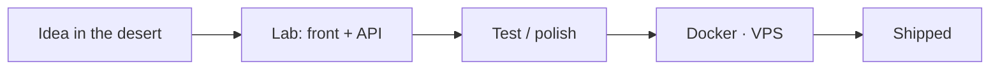

<div align="center">


# Say my name.

### Lucas Gomes Roseira · `@LucasRoseira`

Full-stack from the Sorocaba area (`America/São_Paulo`).  
I cook interface, API, and deploy — lab-grade care, one foot in the desert.

*Diga o meu nome.* Full-stack da região de Sorocaba. Eu cozinho interface, API e deploy — com capricho de laboratório e um pé no deserto.

[](https://github.com/LucasRoseira)
[](https://github.com/LucasRoseira/gomesroseira)
[](https://gomesroseira.com.br/)
[](https://github.com/LucasRoseira)

English first. Portuguese sits under each section.

</div>

---

## About · Sobre

Hi — I'm **Lucas**. Brazilian, from Sorocaba and around it, a full-stack / web developer. On the front I want the screen to breathe; on the back I want a clear contract; on infra I want the container up without a ritual.

I don't sell a magic formula. I ship product: polished UX, an API you can maintain, Docker on a VPS, and PT/EN when the project needs both languages.

Off the bench, chess. Inside the lab, coffee — the real blue chemistry.

> *I am the one who knocks… no `deploy`.*

**Português** — Olá, eu sou o **Lucas**, full-stack de Sorocaba e arredores. No front a tela respira; no back o contrato é claro; na infra o container sobe sem ritual. Entrego UX caprichada, API que dá para manter e Docker no VPS — e PT/EN quando o projeto pede os dois. Fora do lab, xadrez. Dentro, café. *Eu sou o que coloca no ar.*

---

## Stack

What I use day to day, and what usually makes it to production:

<p>
  
  
  
  
  
  
</p>
<p>
  
  
  
  
  
  
</p>
<p>
  
  
  
  
</p>

Front end, API, and the container. The path usually looks like this:



**Português** — Front, API e container. O caminho: ideia no deserto → lab → capricho → Docker no VPS → no ar.

---

## Now showing · Em cartaz

| Episode | What it is | Where to look |
| :--- | :--- | :--- |
| **S01 · Cinematic portfolio** | Site in **Vue 3 + TypeScript + Tailwind + GSAP**. Horizontal “episode” UX, desert/lab mood, **my** photos (not stills from the show), procedural audio, and a fan disclaimer in the footer. PT/EN. | [gomesroseira](https://github.com/LucasRoseira/gomesroseira) · [gomesroseira.com.br](https://gomesroseira.com.br/) |
| **S02 · Projeto Ampliar** | Education in the Sorocaba area: admin + blog, an API in the **Nest / .NET** style, a **Next** front end, a **TipTap** rich-text editor, and student/teacher schedule links. | [projeto-ampliar-front](https://github.com/LucasRoseira/projeto-ampliar-front) |
| **S03 · Laravel tools** | Utilities and systems in Laravel (with Docker when they need a VPS). Less hype, more tool somebody actually uses. | GitHub · `@LucasRoseira` |

Older repos on this account — URI, Fatec, bootcamps, study CRUDs — are the **lab notebook**. I leave them visible on purpose: everybody starts somewhere.

**Português**

- **S01 · Portfólio cinemático** — Vue 3, TypeScript, Tailwind e GSAP. UX por episódios, clima deserto/lab, fotos minhas, áudio procedural, disclaimer de fã. [gomesroseira](https://github.com/LucasRoseira/gomesroseira) · [site](https://gomesroseira.com.br/)
- **S02 · Projeto Ampliar** — educação em Sorocaba: admin, blog, API no estilo Nest/.NET, front em Next, TipTap e agenda. [projeto-ampliar-front](https://github.com/LucasRoseira/projeto-ampliar-front)
- **S03 · Ferramentas Laravel** — utilitários e sistemas em Laravel, com Docker quando vão para o VPS. GitHub · `@LucasRoseira`

O caderno antigo (URI, Fatec, bootcamps, CRUD de estudo) fica visível de propósito.

<details>
<summary><strong>Old lab notebook · Caderno antigo</strong></summary>

- [portifolio.github.io](https://github.com/LucasRoseira/portifolio.github.io) — old portfolio · portfólio antigo
- [frequentia](https://github.com/LucasRoseira/frequentia) — member attendance · frequência de membros
- [Bootcamp-orange-tech](https://github.com/LucasRoseira/Bootcamp-orange-tech) — JS / TS / React
- [PHP_OOP](https://github.com/LucasRoseira/PHP_OOP) — OOP / MVC
- [express-crud](https://github.com/LucasRoseira/express-crud) · [front-todo-app](https://github.com/LucasRoseira/front-todo-app) · [back-todo-app](https://github.com/LucasRoseira/back-todo-app)

</details>

---

## On the burner · No fogão

No promise of a full season. What's cooking:

- Polish the cinematic portfolio — timing, audio, episodes
- Grow **Projeto Ampliar** (content, scheduling, admin)
- **Laravel** tools + **Docker / VPS** deploys
- UX that feels like a product, not a Friday-night prototype

**Português** — Sem temporada completa prometida: polir o portfólio (timing, áudio, episódios), evoluir o Ampliar (conteúdo, agenda, admin), ferramentas Laravel com Docker/VPS, e UX que parece produto.

<div align="center">

[](https://github.com/LucasRoseira)

**Public** activity only. No peeking into the closed lab.  
*Português — só atividade pública. Nada de espiar o lab fechado.*

</div>

---

## Let's talk · Bora conversar

Got a product to grow, a legacy system to modernize, or a desert that needs a lab? Say the word.

- GitHub: [github.com/LucasRoseira](https://github.com/LucasRoseira)
- Portfolio (repo): [github.com/LucasRoseira/gomesroseira](https://github.com/LucasRoseira/gomesroseira)
- Site: [gomesroseira.com.br](https://gomesroseira.com.br/)

**Português** — Tem produto para evoluir, legado para modernizar ou um deserto que precisa de um lab? Chama. Os links são os mesmos.

```
      ___
     /   \      LUCAS GOMES ROSEIRA
    |  ░  |     full-stack · Sorocaba
    | ░░░ |     “say my name”
     \___/      “diga o meu nome”
      | |
     /___\      café + TypeScript + docker compose up
```

---

<div align="center">

### Fan-made · not affiliated

This README — and the desert/lab mood of the portfolio — is a **fan tribute** to *Breaking Bad*.  
**I am not affiliated** with AMC, Sony Pictures Television, Vince Gilligan, or the show's production.  
Nothing here is official content.  
No stills, official logos, or excerpts from the work — just metaphor, markdown, and a blue flask I drew myself.

**Português** — Homenagem de fã a *Breaking Bad*. **Não sou afiliado** à AMC, Sony Pictures Television, Vince Gilligan nem à produção da série. Nada aqui é oficial: sem stills, logos ou trechos — só metáfora, markdown e um frasco azul que eu mesmo desenhei.

Heisenberg is fiction. The deploy is real.  
*Heisenberg é ficção. O deploy é real.*

</div>
