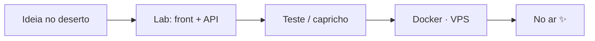

<div align="center">


# Diga o meu nome.

### Lucas Gomes Roseira · `@LucasRoseira`

**Full-stack da região de Sorocaba (America/São_Paulo).**  
Eu cozinho interface, API e deploy — com capricho de laboratório e um pé no deserto.

*Say my name. I cook polished UX, then I ship it.*

[](https://github.com/LucasRoseira)
[](https://github.com/LucasRoseira/gomesroseira)
[](https://gomesroseira.com.br/)
[](https://github.com/LucasRoseira)

</div>

---

## Sobre mim

Olá — eu sou o **Lucas**. Brasileiro, de Sorocaba e arredores, desenvolvedor full-stack / web. No front eu quero que a tela respire; no back eu quero contrato claro; na infra eu quero o container no ar sem ritual.

Não vendo fórmula mágica. Entrego produto: UX caprichada, API que dá para manter, Docker no VPS, e PT/EN quando o projeto pede os dois idiomas.

Fora do lab, xadrez. Dentro do lab, café — a verdadeira química azul.

> *I am the one who knocks… no `deploy`.*  
> Eu sou o que coloca no ar.

---

## Stack / ferramentas

O que uso no dia a dia (e o que costuma ir para produção):

<p>
  
  
  
  
  
  
</p>
<p>
  
  
  
  
  
  
</p>
<p>
  
  
  
  
</p>



---

## Em cartaz — projetos em destaque

| Episódio | O que é | Onde ver |
| :--- | :--- | :--- |
| **S01 · Portfólio cinemático** | Site em **Vue 3 + TypeScript + Tailwind + GSAP**. UX horizontal “por episódios”, clima deserto/lab, fotos **minhas** (não stills da série), áudio procedural e disclaimer de fã no rodapé. PT/EN. | [gomesroseira](https://github.com/LucasRoseira/gomesroseira) · [gomesroseira.com.br](https://gomesroseira.com.br/) |
| **S02 · Projeto Ampliar** | Educação na região de Sorocaba: admin + blog, API no estilo **Nest / .NET**, front em **Next**, editor rico com **TipTap**, links de agenda aluno/professor. | [projeto-ampliar-front](https://github.com/LucasRoseira/projeto-ampliar-front) |
| **S03 · AgroSafety** | Trabalho de **conteúdo** — texto e presença web, sem teatro químico de série: laboratório de verdade, comunicação clara. | — |
| **S04 · Ferramentas Laravel** | Utilitários e sistemas em Laravel (com Docker quando precisa ir para o VPS). Menos hype, mais ferramenta que alguém usa. | GitHub · `@LucasRoseira` |

Repositórios mais antigos na conta — URI, Fatec, bootcamps, CRUD de estudo — são o **caderno de laboratório**. Eu deixo visível de propósito: todo mundo começa em algum lugar.

<details>
<summary><strong>Caderno antigo (estudo / aprendizado)</strong></summary>

- [portifolio.github.io](https://github.com/LucasRoseira/portifolio.github.io) — portfólio antigo  
- [frequentia](https://github.com/LucasRoseira/frequentia) — frequência de membros  
- [Bootcamp-orange-tech](https://github.com/LucasRoseira/Bootcamp-orange-tech) — JS / TS / React  
- [PHP_OOP](https://github.com/LucasRoseira/PHP_OOP) — OOP / MVC  
- [express-crud](https://github.com/LucasRoseira/express-crud) · [front-todo-app](https://github.com/LucasRoseira/front-todo-app) · [back-todo-app](https://github.com/LucasRoseira/back-todo-app)

</details>

---

## No fogão agora

O que está cozinhando (sem prometer temporada completa):

- Polir o portfólio cinemático — timing, áudio, episódios  
- Evoluir o **Projeto Ampliar** (conteúdo, agenda, admin)  
- Ferramentas **Laravel** + deploys **Docker / VPS**  
- UX que parece produto, não protótipo de sexta à noite  

<div align="center">

[](https://github.com/LucasRoseira)

<sub>Widget só com atividade **pública**. Nada de espiar o lab fechado.</sub>

</div>

---

## Bora conversar

Tem produto para evoluir, legado para modernizar ou um deserto que precisa de um lab? Chama.

- GitHub: [github.com/LucasRoseira](https://github.com/LucasRoseira)  
- Portfólio (repo): [github.com/LucasRoseira/gomesroseira](https://github.com/LucasRoseira/gomesroseira)  
- Site: [gomesroseira.com.br](https://gomesroseira.com.br/)

```
      ___
     /   \      LUCAS GOMES ROSEIRA
    |  ░  |     full-stack · Sorocaba
    | ░░░ |     “say my name”
     \___/
      | |
     /___\      café + TypeScript + docker compose up
```

---

<div align="center">

### Fan-made · sem afiliação

Este README — e o clima deserto/lab do portfólio — são **homenagem de fã** a *Breaking Bad*.  
**Não sou afiliado** à AMC, Sony Pictures Television, Vince Gilligan nem à produção da série.  
Nada aqui é conteúdo oficial. *Fan-made tribute. Not affiliated with AMC, Sony, or Breaking Bad.*  
Sem stills, logos oficiais ou trechos da obra — só metáfora, markdown e um frasco azul que eu mesmo desenhei.

<sub>Heisenberg é ficção. O deploy é real.</sub>

</div>
